# Setting Up a Microbial Fuel Cell: An Absolute Beginner's Guide

So, you want to set up your first microbial fuel cell, but you have no idea where to start? That makes two of us - or at least it would, if you were talking to me from 2 months ago. I have a [fair amount of experience ](https://scholar.google.com/citations?user=tae1A2AAAAAJ&hl=en)in fundamental electrochemistry, but it was only upon starting my fellowship as a Marie Skłodowska Curie at the Université de Rennes 1 that I actually got around to assembling an actual fuel cell. This short blog will serve as a quick guide on how to go about this. I'm not claiming that this method is perfect (feel free to chip in with improved tips or suggestions if you are reading this as an expert) but it should be enough to get started. Also, while my focus is on microbial fuel cells, the basic assembly described here should also be suitable for a variety of similar devices.

## A Preview of What We Will be Making

Below is a preview of the end product - a fully assembled 'H type' fuel cell. The anode and cathode compartments are separated by a proton exchange membrane in the centre.

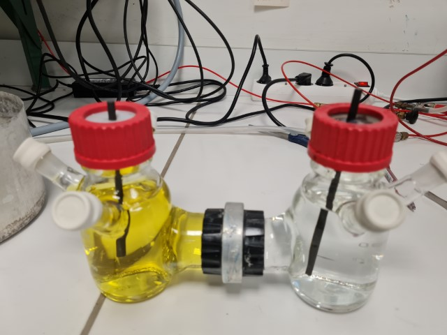

## Glassware

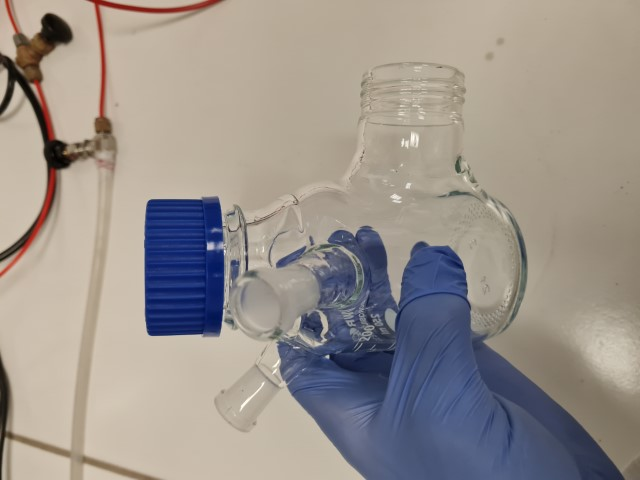

Probably the most important part of the whole process is deciding on the type of glassware you are going to use. Above is a photo of one half of the H cell, which is formed based on a 250 mL borosilicate glass bottle. After a trip to the local glassblower, 3 ports were added to the bottle in addition to the bridge at the bottom for the H-cell assembly. I wanted 3 ports to have one space reserved for a reference electrode, one space reserved for introducing inert gas, and one final port to use for pumping out the cell contents. Looking back now, it might have been preferable to have this 3rd port placed lower on the glass bottle for ease of pumping - try to think about what your particular application will need (pH meter? thermometer? microelectrode probe?...) and come up with a design that suits. 

## Joining the Glassware

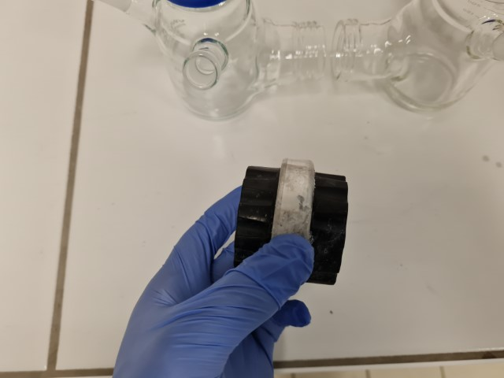

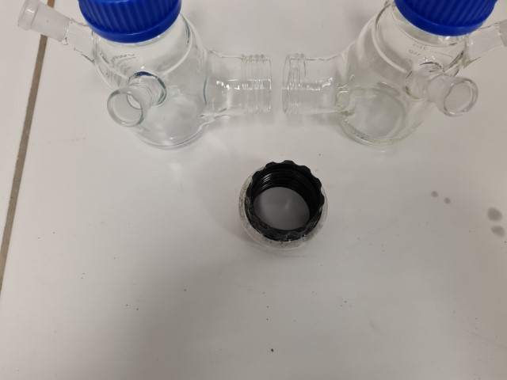

I don't know the proper name for the above piece of kit that 'joins' the 2 cells together, but it is essentially like the blue twist caps pictured on the bottles, except with 2 sides and a hole in the centre. The idea is to simply twist both cells on to this 'joiner' via the lower port, forming the 'H-cell' shape. In our lab, we have also had some success with an alternative design which uses a flat cylindrical glass port on each bottle and a clamp to hold the cells together. I will focus on the screw cap design in this post, though, as I am more aware of its pitfalls!

Before using the joiner, inspect the interior threads for any debris or defects. In particular if you are re-using an old joiner, rinse it well with millipore water (or at least distilled water) to remove any lingering salts remaining from buffer solutions. Anything blocking the threads will make it difficult to screw the glassware together and will cause headaches later.

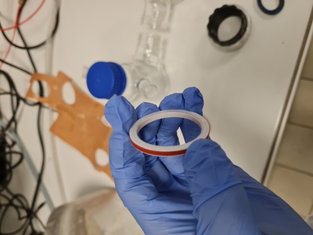

In order to use the 'double screw' connection type, you will need to form a seal between the glass bottles and the proton exchange membrane, so that the solution inside does not leak out of the fuel cell or cross over from one side to the other. We accomplish this using the O-ring pictured below, but you can also try with a more typical black vycor o-ring of the same diameter.

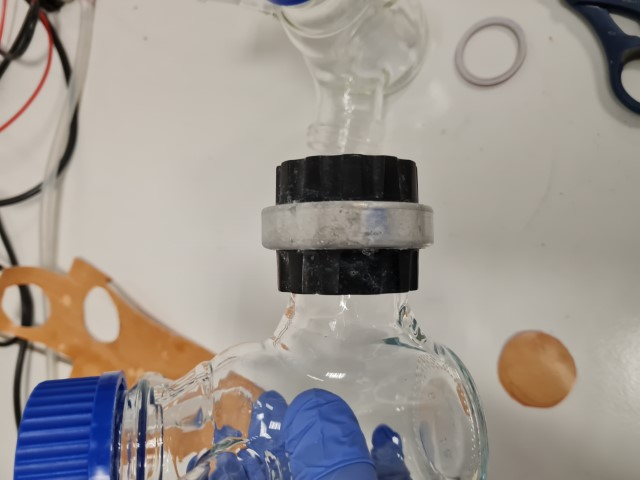

## Screw it on Straight!

Start by screwing the joiner on to the port of one of the glass bottles. Take care to ensure that it is screwed on perfectly straight - with these screw assemblies, it is very easy to 'tighten' them without properly orienting the glass threads into the corresponding grooves on the cap. If that happens you are liable to either have a leaking fuel cell, or to break the glass assembly when trying to tighten it due to misalignment.

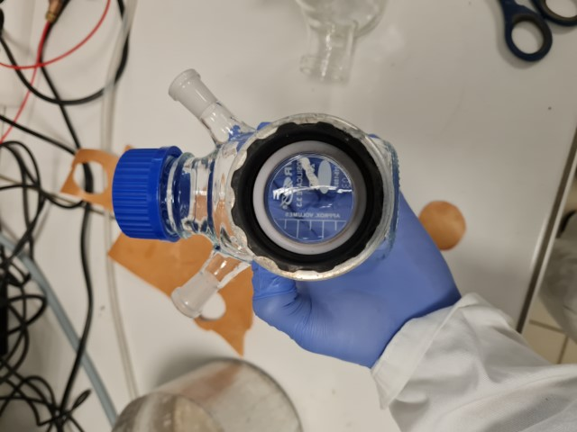

Once you have screwed on the joiner, check that you can easily insert the o ring in the middle. It should fit snugly inside the joiner on top of the glass, as pictured above. If there are any noticeable gaps or evidence of a poor seal (e.g. if you are re-using an old o-ring or joiner) *save yourself time later by replacing them now.* If the cell doesn't seal properly, you will have to disassemble everything later anyway.

## The Membrane

Below is an example of a proton exchange membrane that we use in our H-cells. We also have transparent Nafion membranes, which seem to be more common in the literature, but for illustration purposes I will stick with this one as it is easier to photograph!

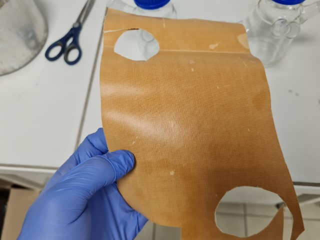

I recommend using the outer diameter of the o-ring as a template for cutting out the membrane. Try to cut out a circle which is slightly larger than this diameter, and then trim the edges.

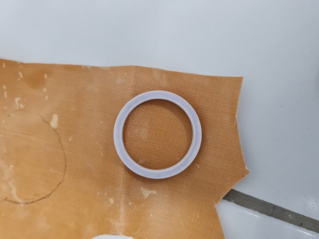

You can see in the below image that the circle is not perfect - in particular there is a jagged corner on the bottom that must be trimmed off with the scissors.

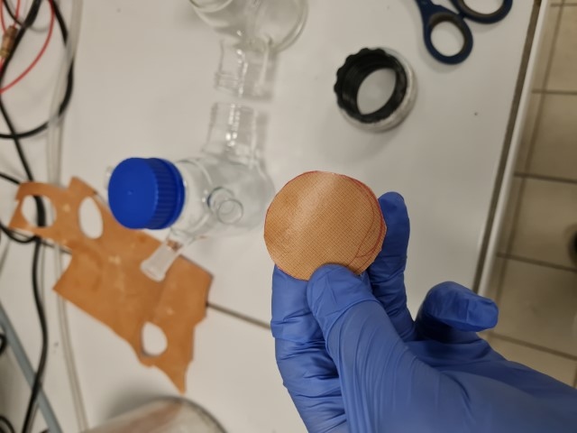

After you cut the membrane to size, insert it into the joiner on top of the o-ring. It should look like the photo below. If you have difficulty getting the membrane to stay flush with the o-ring, you need to trim the edges a little more. In particular if the membrane is 'bending' against the sides of the joiner, you won't get a good seal in the final assembly and it will more than likely leak. Trim the edges until it fits comfortably. Don't trim them too much, however, as this will leave enough space for a leak across the cells (and compromise your experiment). It is OK if you can see part of the o-ring beneath the membrane (as I can in the bottom right of the joiner in the photo below) but any more than this will result in a leak, at least in my experience.

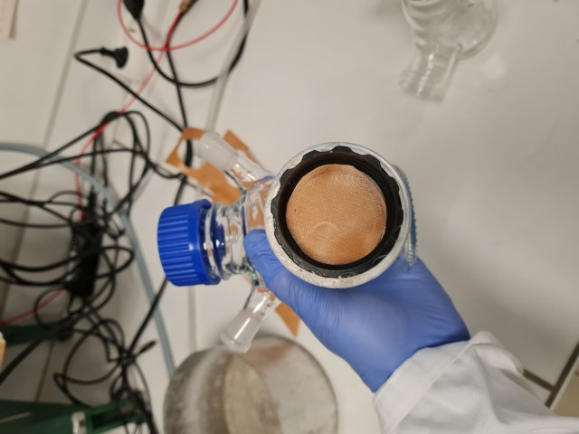

## The Hardest Part: Screwing the Full Assembly

Once you have screwed on the joiner, placed the o-ring and inserted the membrane, the hardest step is to screw on the second half of the cell. I recommend holding the glassware together from one side and 'turning' the joiner like screwing on a bottle cap. If you feel some resistance, verify that the whole assembly is perfectly straight before applying pressure. If you aren't careful you can force the glassware together at an angle. Then not only will it not seal properly, but you also will have a hard time unscrewing it again for a second try without breaking it. Basically, you need to screw it on straight, relatively tight, without disturbing the o-ring and membrane inside. I find that once it is close to tight enough, you can finish off tightening by turning the bottles themselves around ***once.* Don't push it! If it feels like you need to join a gym and lift weights to tighten it up, stop! You will more than likely just break the glass and have to start over again.** 

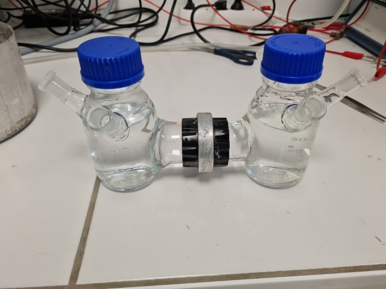

Once you have assembled the cell, it's time to test your work. First, fill both bottles up to the same level with pure water and carefully inspect the join for leaks. If the seal is very poor (for reasons outlined above) it will more than likely leak immediately, and you can disassemble the cell and try again. However even if the assembly *doesn't* leak right away, a slow leak could still develop over time. For this reason I recommend placing the cell inside a basin on top of some tissue and leave it for at least 24 hours. You can mark the level of the water inside both bottles with a marker so that it will be obvious if the solution level drops below.

Regardless of the type of fuel cell you will run, I recommend making use of ferricyanide solution at this stage as a means of checking the cell's integrity. Ferricyanide is often used as an electron acceptor in microbial fuel cells, but even if you intend to run your cell based on oxygen or to instead run it as an electrolysis cell, ferricyanide can be invaluable in diagnosing leaks or issues with the membrane before starting a long experiment.

Choose one compartment as your cathode and label it as such. Fill it with ferricyanide solution (50 mM in buffer should be enough) and fill the anode compartment with the same buffer (minus ferricyanide) to avoid osmotic pressure issues. The assembly should look as below. The yellow color of aqueous ferricyanide is invaluable here, as it will be very obvious if there is a leak either out of the cell or from cathode to anode. After at least 24 hours (ideally slightly longer), use a 3 electrode setup with the working and reference electrode in the anode compartment and counter electrode in the cathode compartment. If there are no ferricyanide peaks found in the anode (about 0.2 V if using an Ag/AgCl reference) then your seal is probably acceptable and you can start your experiment. 

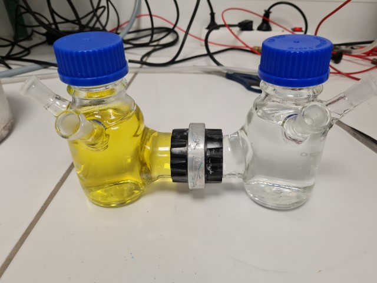

## Some Finer Details

At this point the 'hard' part is over, but there are still many things to think about for your fuel cell setup. In my case, we need the anodic compartment to be anaerobic, so the ports of the cell need to be tightly sealed with stoppers or septa like the one pictured below. These allow for inoculation of the solution with syringes or sparging with inert gas and (if new) keep a good seal after repeated use.

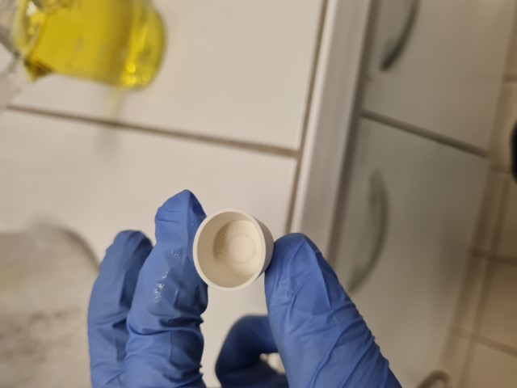

For sealing off the top of the cell, I prefer to swap the typical screw cap with a disk shaped septum like the one below.

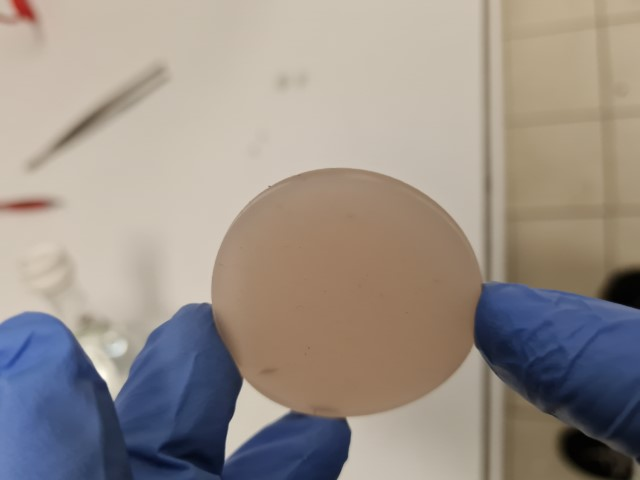

This can be combined with an open top screw cap (below) or simply a regular screw cap with some holes drilled to allow for your electrode to fit inside.

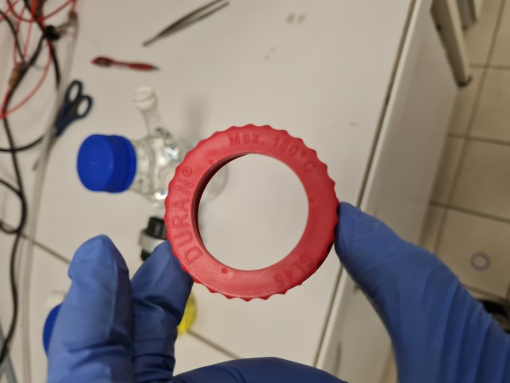

The septum + cap should look as below when assembled:

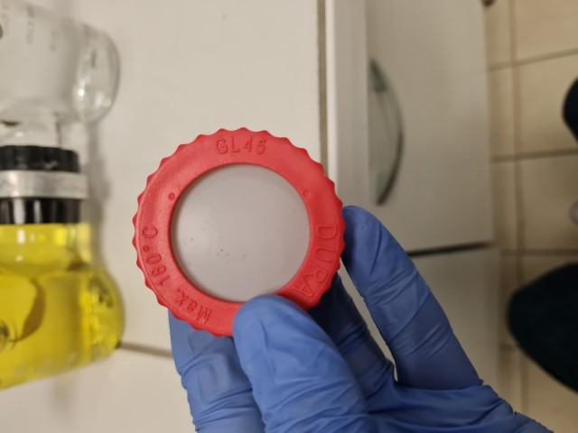

You can be as creative as you want for the insertion of electrodes here. A simple solution is to simply pierce the septum with the electrode, as shown for the graphite rod below. However this may not allow for a good enough seal in the case of strictly anaerobic microbial fuel cells, or if trying to grow pure cultures. In that case waterproof contacts attached to wires may be preferable, or the septum can be replaced for another material (such as blue butyl stoppers used often in anaerobic culturing).

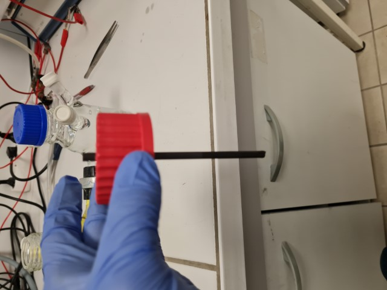

For the reference electrode, a home made Ag/AgCl like the one below works well and can be left in the assembly for some time to monitor a long experiment reliably. It will periodically need to be reconditioned or replaced, but this can easily be evaluated using a standard probe such as ferricyanide. 

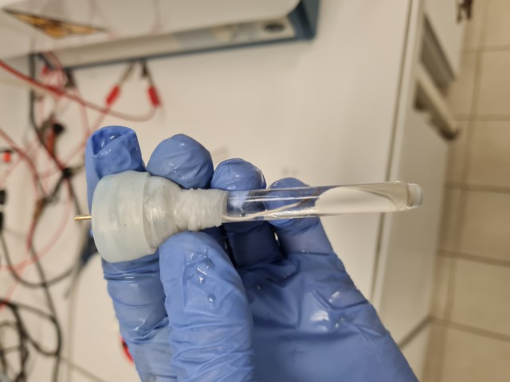

Note how the reference below has been inserted into a septum and held in place with parafilm - this will allow the reference electrode to seal tightly onto the port and avoid it detaching from the septum and falling into the solution...not that that ever happened to me...

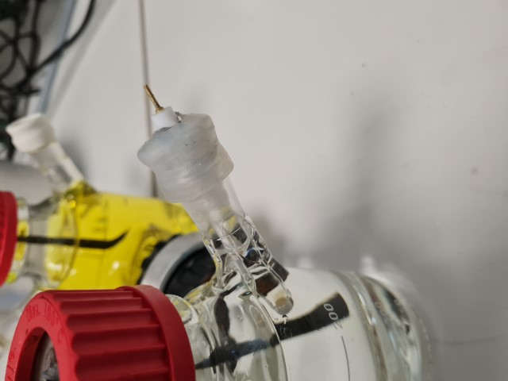

## Checking the Resistance

At this point  it is a good idea to check the resistance across the H-cell in your buffer using a voltmeter. Tens to hundreds of ohms in resistance is ideal, but even a few kOhm is acceptable. If you are reading high kOhms or MOhms in a reasonable buffer (such as PBS), you have a problem with your membrane or there is an air bubble in the joint. Try to agitate the cell (gently) and retest the resistance. If it doesn't drop, you will need to disassemble the cell and change the membrane. It is also a good idea to monitor this resistance periodically during your experiment - if it is a microbial fuel cell, colonisation of the membrane could increase the resistance across the cell, or a trapped bubble of gas could effectively close the circuit. Monitoring isn't too time consuming and can save time in the long run by catching these problems.

## Closing the Circuit

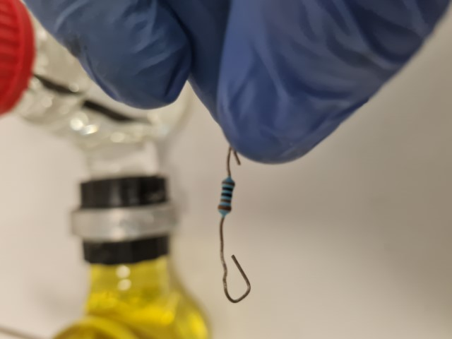

For microbial fuel cells, a typical means of completing the cell circuit is with an external resistor like the one above. You can match your resistor to the internal resistance of the cell measured with the voltmeter above, or just use a common value (like ~500-1000 ohms). Of course if you intend to control the anode potential with a potentiostat or otherwise apply a potential, this is unnecessary.

## Here's One we Prepared Earlier...

Below is a microbial fuel cell running with an anode colonised by exoelectrogenic bacteria fed with acetate running against a ferricyanide cathode. Both electrodes use a 10 mM phosphate buffer at pH close to 7. You can see a fairly typical open circuit potential of ~760 mv as measured with a voltmeter. The cell is kept at about 30 degrees in a water bath and protected from light with Al foil. A cell like this can be used for a variety of experiments for a long time, with only periodic monitoring of important parameters (like the internal resistance or the buffer pH) required to keep the system going. Also note that the cell is being degassed using Ar with an inlet and exhaust syringe - take care when sparging not to use too high of an overpressure of gas and to be sure you have an outlet before turning the gas on. Otherwise you might have septa flying across the lab...

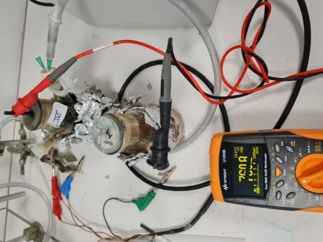

## Conclusion

I hope that this simple guide was helpful to anyone just starting out assembling fuel cells. In the future, I may follow up with similar content about some of the points I glossed over here, or try to cover some of the fundamentals for a less technical or specialist audience. Stay tuned!